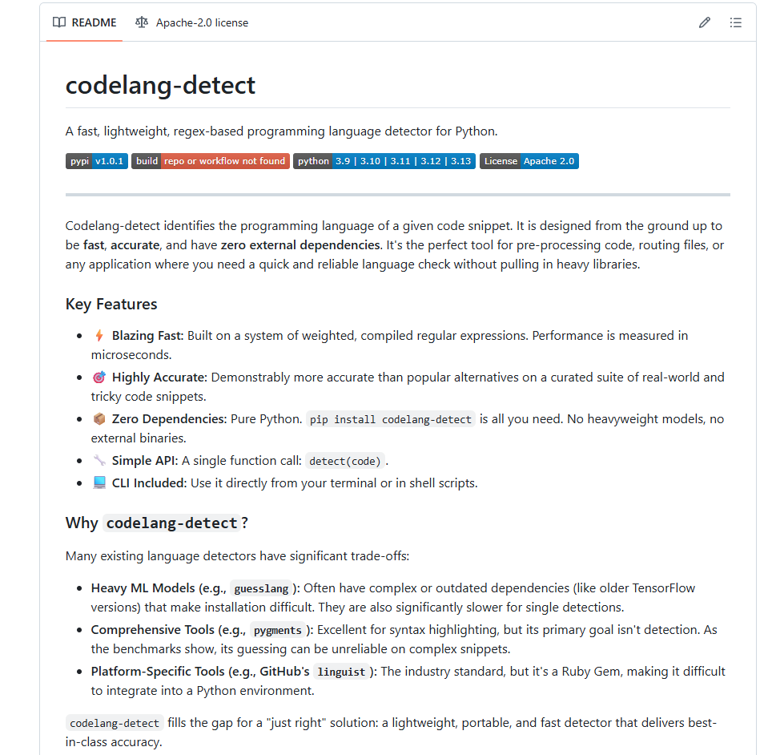

# codelang-detect

A fast, lightweight, regex-based programming language detector for Python.

[](https://www.youtube.com/watch?v=bsB47ZS5tsQ)

[](https://pypi.org/project/codelang-detect/)
[](https://github.com/cbarkinozer/codelang-detect/actions)
[](https://pypi.org/project/codelang-detect/)
[](https://opensource.org/licenses/Apache-2.0)

---

Codelang-detect identifies the programming language of a given code snippet. It is designed from the ground up to be **fast**, **accurate**, and have **zero external dependencies**. It's the perfect tool for pre-processing code, routing files, or any application where you need a quick and reliable language check without pulling in heavy libraries.

### Key Features

-   ⚡️ **Blazing Fast:** Built on a system of weighted, compiled regular expressions. Performance is measured in microseconds.
-   🎯 **Highly Accurate:** Demonstrably more accurate than popular alternatives on a curated suite of real-world and tricky code snippets.
-   📦 **Zero Dependencies:** Pure Python. `pip install codelang-detect` is all you need. No heavyweight models, no external binaries.
-   🔧 **Simple API:** A single function call: `detect(code)`.
-   💻 **CLI Included:** Use it directly from your terminal or in shell scripts.

### Why `codelang-detect`?

Many existing language detectors have significant trade-offs:

-   **Heavy ML Models (e.g., `guesslang`):** Often have complex or outdated dependencies (like older TensorFlow versions) that make installation difficult. They are also significantly slower for single detections.
-   **Comprehensive Tools (e.g., `pygments`):** Excellent for syntax highlighting, but its primary goal isn't detection. As the benchmarks show, its guessing can be unreliable on complex snippets.
-   **Platform-Specific Tools (e.g., GitHub's `linguist`):** The industry standard, but it's a Ruby Gem, making it difficult to integrate into a Python environment.

`codelang-detect` fills the gap for a "just right" solution: a lightweight, portable, and fast detector that delivers best-in-class accuracy.

### Benchmark: Accuracy & Performance

The results speak for themselves. On a [curated set of 36 code snippets](https://github.com/cbarkinozer/codelang-detect/blob/main/tests/test_data.json) designed to test real-world accuracy, `codelang-detect` is both significantly more accurate and an order of magnitude faster than other popular, lightweight libraries.

| Library                    | Accuracy  | Avg. Time / Sample (µs) | Dependencies     |
| -------------------------- | :-------: | :---------------------: | ---------------- |
| **`codelang-detect` (Ours)** | **100%**  |       **~173 µs**     | **None**         |
| `Pygments`                 |  22.2%    |       ~1395 µs        | None             |
| `WhatsThatCode`            |  30.6%    |       ~1881 µs        | None             |

*Benchmarks run on Python 3.13. Your results may vary.*

As the results show, `codelang-detect` is not only the most accurate solution on this test suite but also **~8x faster than `Pygments`** and **~11x faster than `WhatsThatCode`**, all while maintaining zero dependencies.

<details>
<summary>Click to see detailed accuracy breakdown</summary>

```
--- Accuracy Benchmark ---
| Test Case          | Expected   | Codelang-Detect (Ours) | Pygments               | WhatsThatCode          |
--------------------------------------------------------------------------------------------------------------
| cs_simple          | cs         | cs                  ✅ | unknown             ❌ | java                ❌ |
| cs_lambda          | cs         | cs                  ✅ | scdoc               ❌ | unknown             ❌ |
| cs_full            | cs         | cs                  ✅ | gdscript            ❌ | unknown             ❌ |
| py_simple          | py         | py                  ✅ | py                  ✅ | py                  ✅ |
| py_class           | py         | py                  ✅ | perl6               ❌ | py                  ✅ |
| java_simple        | java       | java                ✅ | py                  ❌ | java                ✅ |
| java_full          | java       | java                ✅ | teratermmacro       ❌ | unknown             ❌ |
| js_arrow           | js         | js                  ✅ | gdscript            ❌ | unknown             ❌ |
| yaml_k8s           | yaml       | yaml                ✅ | actionscript3       ❌ | unknown             ❌ |
| sh_shebang         | sh         | sh                  ✅ | sh                  ✅ | sh                  ✅ |
| kt_data_class      | kt         | kt                  ✅ | ssp                 ❌ | unknown             ❌ |
| swift_func         | swift      | swift               ✅ | gdscript            ❌ | unknown             ❌ |
| scala_case_class   | scala      | scala               ✅ | unknown             ❌ | unknown             ❌ |
| sql_select         | sql        | sql                 ✅ | scdoc               ❌ | unknown             ❌ |
| cbl_simple         | cbl        | cbl                 ✅ | componentpascal     ❌ | unknown             ❌ |
| plain_text         | unknown    | unknown             ✅ | unknown             ✅ | unknown             ✅ |
| cs_async_method    | cs         | cs                  ✅ | gdscript            ❌ | cs                  ✅ |
| cs_linq_query      | cs         | cs                  ✅ | gdscript            ❌ | js                  ❌ |
| py_async_http      | py         | py                  ✅ | py                  ✅ | unknown             ❌ |
| py_pandas          | py         | py                  ✅ | py                  ✅ | unknown             ❌ |
| java_streams       | java       | java                ✅ | py                  ❌ | unknown             ❌ |
| js_promise_fetch   | js         | js                  ✅ | gdscript            ❌ | unknown             ❌ |
| js_react_component | js         | js                  ✅ | py                  ❌ | unknown             ❌ |
| ts_interface       | ts         | ts                  ✅ | gdscript            ❌ | unknown             ❌ |
| kt_coroutine       | kt         | kt                  ✅ | py                  ❌ | py                  ❌ |
| swift_struct       | swift      | swift               ✅ | gdscript            ❌ | unknown             ❌ |
| scala_future       | scala      | scala               ✅ | py                  ❌ | unknown             ❌ |
| go_http_server     | go         | go                  ✅ | py                  ❌ | go                  ✅ |
| sql_join           | sql        | sql                 ✅ | scdoc               ❌ | unknown             ❌ |
| yaml_dockercompose | yaml       | yaml                ✅ | scdoc               ❌ | unknown             ❌ |
| sh_env_check       | sh         | sh                  ✅ | sh                  ✅ | sh                  ✅ |
| rb_class           | rb         | rb                  ✅ | tsql                ❌ | rb                  ✅ |
| php_router         | php        | php                 ✅ | javascript+php      ❌ | php                 ✅ |
| rust_result        | rs         | rs                  ✅ | ecl                 ❌ | unknown             ❌ |
| c_function_pointer | c          | c                   ✅ | c                   ✅ | unknown             ❌ |
| plain_text_doc     | unknown    | unknown             ✅ | unknown             ✅ | unknown             ✅ |
```

</details>

*Note: Libraries like `guesslang` and `enry` were excluded from the final benchmark due to significant installation issues with modern Python versions and their respective dependencies.*

### Installation

```bash
pip install codelang-detect
```

### Usage

#### As a Python Library

The API is dead simple. The `detect` function takes a string of code and returns the file extension of the detected language.

```python
from codelang_detect import detect

# Example 1: Python
python_code = "class User:\n    def __init__(self, name): self.name = name"
print(detect(python_code))
# Output: py

# Example 2: C#
csharp_code = "public class Person { public string Name { get; set; } }"
print(detect(csharp_code))
# Output: cs

# Example 3: Non-code
unknown_text = "This is just a regular sentence."
print(detect(unknown_text))
# Output: unknown
```

#### As a Command-Line Tool (CLI)

You can also use `codelang-detect` directly from your terminal to analyze files or `stdin`.

```bash
# Analyze a file
codelang-detect my_script.js
# Output: js

# Pipe content into the CLI
cat deployment.yaml | codelang-detect
# Output: yaml
```

### Supported Languages

`codelang-detect` currently provides high-quality detection for the following languages, sorted by their returned extension:

-   C (`c`)
-   C++ (`cpp`)
-   C# (`cs`)
-   COBOL (`cbl`)
-   Dart (`dart`)
-   Go (`go`)
-   Java (`java`)
-   JavaScript (`js`)
-   Kotlin (`kt`)
-   PHP (`php`)
-   Python (`py`)
-   R (`r`)
-   Ruby (`rb`)
-   Rust (`rs`)
-   Scala (`scala`)
-   Shell (`sh`)
-   Solidity (`sol`)
-   SQL (`sql`)
-   Swift (`swift`)
-   TypeScript (`ts`)
-   YAML (`yaml`)

### How It Works

No magic here. `codelang-detect` uses a curated list of regular expressions for each language. Each regex is assigned a "weight" based on how uniquely it identifies a language.

For example:
-   The pattern `async Task<` is a very strong signal for **C#** and gets a high weight.
-   The keyword `def` is a strong signal for **Python** but could also appear in Scala or Ruby, so it gets a moderate weight.
-   The keyword `class` is a weak signal, as it appears in many languages, and requires more context to be useful.

The library runs all regexes against the input code, sums the weights for each language, and returns the language with the highest score. It's simple, transparent, and incredibly fast.

### Running Tests
This project uses pytest for testing. To run the test suite, first install the development dependencies and then run pytest:
```bash
# Install development dependencies
pip install -r requirements-dev.txt

# Run the test suite
pytest
```
### Contributing

Contributions are welcome and appreciated! This project was started to fill a gap, and community help is the best way to make it the definitive tool for this job.

Whether it's improving regexes, adding support for a new language, or fixing a bug, please feel free to:

1.  [Open an issue](https://github.com/cbarkinozer/codelang-detect/issues) to discuss the change.
2.  Fork the repository and submit a pull request.

When adding a language or fixing a misidentification, please add relevant code snippets to `tests/test_data.json`. This helps verify your changes and prevents future regressions. We follow a simple principle: if a human can't reliably distinguish a short snippet, the detector probably can't either, so focus on realistic test cases.

### License

This project is licensed under the Apache 2.0 License - see the [LICENSE](LICENSE) file for details.